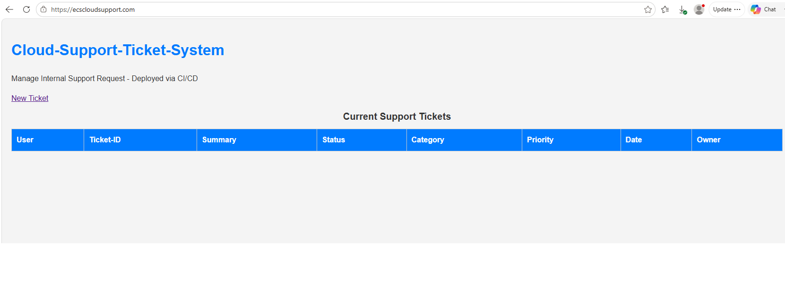
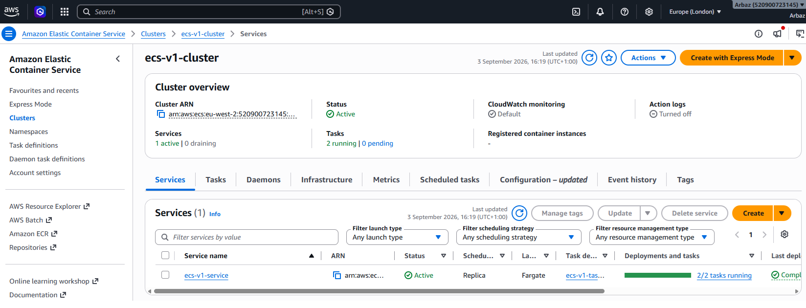
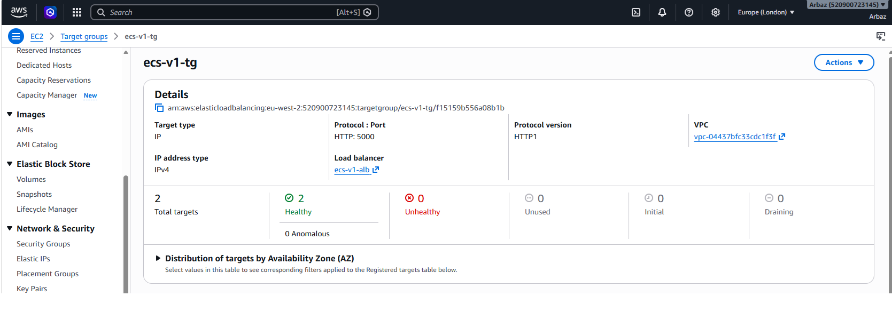
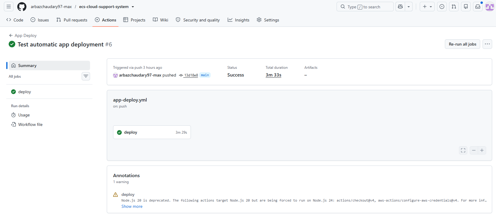
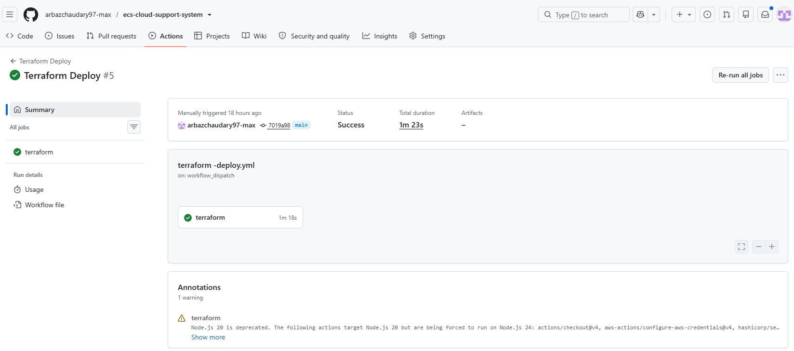

# ECS Cloud Support Ticket System

A cloud-based internal support ticket application deployed to AWS using a complete DevOps workflow.

The project demonstrates how an application can be containerised with Docker, provisioned using Terraform, deployed to Amazon ECS Fargate, and automatically updated through a GitHub Actions CI/CD pipeline.

The infrastructure is designed using a custom VPC with public and private subnets across two Availability Zones. An Application Load Balancer receives internet traffic and forwards requests to ECS Fargate tasks running inside the private subnets.

The application is secured using HTTPS with AWS Certificate Manager (ACM), while Route 53 provides DNS for the custom domain.

## Live Application

**Application:** https://ecscloudsupport.com

> The live environment may be unavailable when the AWS infrastructure has been destroyed to avoid unnecessary cloud costs.

## Project Goals

The main goals of this project were to:

- Build a simple internal Cloud Support Ticket System using Flask.
- Containerise the application using Docker.
- Store Docker images in Amazon ECR.
- Provision AWS infrastructure using modular Terraform.
- Run the application using Amazon ECS Fargate.
- Keep application containers inside private subnets.
- Route public traffic through an Application Load Balancer.
- Configure a custom domain using Amazon Route 53.
- Secure the application using HTTPS and AWS Certificate Manager.
- Implement automated application deployments using GitHub Actions.
- Authenticate GitHub Actions to AWS using OIDC instead of long-lived AWS access keys.
- Store Terraform state remotely in Amazon S3.
- Send ECS container logs to Amazon CloudWatch.
- Provide separate workflows for infrastructure deployment and destruction.


## Architecture

For a detailed architecture diagram, see:

[View the full architecture diagram](architecture/architecture.md)

The application uses a highly available AWS network design across two Availability Zones in the London (`eu-west-2`) region.

### Request Flow

When a user accesses the application, the request follows this path:

User → Route 53 → Application Load Balancer → ECS Fargate → Flask Application

1. **Amazon Route 53** resolves `ecscloudsupport.com` to the Application Load Balancer.
2. **AWS Certificate Manager (ACM)** provides the TLS certificate used to secure the application with HTTPS.
3. The **Application Load Balancer (ALB)** is deployed across two public subnets and accepts HTTP/HTTPS traffic.
4. HTTP requests are redirected to HTTPS.
5. HTTPS traffic is forwarded from the ALB to the ECS target group on port `5000`.
6. **Amazon ECS Fargate** runs two copies of the containerised Flask application across private subnets.
7. The ECS security group only allows application traffic from the ALB security group.
8. A **NAT Gateway** allows the private ECS tasks to make outbound connections without exposing them directly to the internet.

### Network Architecture

The custom VPC uses the CIDR range:

`10.0.0.0/16`

It contains four subnets across two Availability Zones:

| Subnet | CIDR | Availability Zone | Purpose |
|---|---|---|---|
| Public Subnet 1 | `10.0.1.0/24` | `eu-west-2a` | ALB and NAT Gateway |
| Public Subnet 2 | `10.0.2.0/24` | `eu-west-2b` | ALB |
| Private Subnet 1 | `10.0.3.0/24` | `eu-west-2a` | ECS Fargate tasks |
| Private Subnet 2 | `10.0.4.0/24` | `eu-west-2b` | ECS Fargate tasks |

An Internet Gateway provides internet connectivity to the public subnets.

The private route table sends outbound internet traffic through a NAT Gateway located in Public Subnet 1. This allows the ECS tasks to access services such as Amazon ECR while keeping the tasks inaccessible directly from the public internet.

## Application

The application is a lightweight internal Cloud Support Ticket System built using Python and Flask.

Users can:

- Create support tickets.
- View existing support tickets.
- View individual ticket details.
- Update ticket status and ownership.
- Manage basic ticket information including category, priority and summary.

The application runs on port `5000` inside the container.

For this project, ticket data is stored in memory. The main focus of the project is the DevOps infrastructure, containerisation and deployment workflow rather than persistent application storage.

## Docker

The Flask application is containerised using Docker.

The Dockerfile:

1. Creates the application runtime environment.
2. Installs the Python dependencies from `requirements.txt`.
3. Copies the Flask application into the container.
4. Exposes port `5000`.
5. Starts the Flask application.

A `.dockerignore` file prevents unnecessary files from being included in the Docker build context.

Containerisation ensures the same application package can run consistently during local testing and when deployed to ECS.

## Amazon ECR

Amazon Elastic Container Registry (ECR) is used as the private Docker image registry for the project.

The deployment pipeline builds the Docker image and pushes it to the:

`ecs-cloud-support-system`

ECR repository in the `eu-west-2` region.

ECS then pulls the image from ECR when new Fargate tasks are launched.

## Amazon ECS Fargate

Amazon ECS is used to orchestrate the application containers, with AWS Fargate providing the underlying serverless compute.

The ECS configuration includes:

- ECS cluster: `ecs-v1-cluster`
- ECS service: `ecs-v1-service`
- Two running Fargate tasks.
- `256` CPU units (0.25 vCPU) per task.
- `512 MB` memory per task.
- Application container listening on port `5000`.
- Tasks deployed inside private subnets.
- `awsvpc` networking mode.
- CloudWatch container logging.

The ECS service maintains a desired count of two tasks. If a task stops, ECS attempts to launch a replacement to maintain the desired state.

The Application Load Balancer target group performs health checks and only routes application traffic to healthy ECS targets.

## CI/CD with GitHub Actions

GitHub Actions is used to automate both application deployment and infrastructure management.

Authentication between GitHub Actions and AWS uses **OpenID Connect (OIDC)**. This allows GitHub Actions to assume AWS IAM roles and obtain temporary credentials without storing long-lived AWS access keys as GitHub secrets.

Three workflows are included in the project:

### 1. Application Deployment

Workflow:

`.github/workflows/app-deploy.yml`

The application deployment workflow automatically runs when application files are pushed to the `main` branch.

The deployment process is:

1. Checkout the GitHub repository.
2. Authenticate to AWS using GitHub OIDC.
3. Login to Amazon ECR.
4. Build the Docker image from the application.
5. Push the new image to ECR.
6. Force a new ECS service deployment.
7. Wait for the ECS service to become stable.

Deployment flow:

Developer → Git Push → GitHub Actions → Docker Build → Amazon ECR → Amazon ECS Fargate

This pipeline was tested by making a visible application change and pushing it to `main`. GitHub Actions automatically deployed the new container image and the change became available on the live application.

### 2. Terraform Deployment

Workflow:

`.github/workflows/terraform-deploy.yml`

Infrastructure deployment is manually triggered using `workflow_dispatch`.

The workflow performs:

1. Checkout repository.
2. Setup Terraform.
3. Authenticate to AWS using OIDC.
4. Run `terraform init`.
5. Run `terraform validate`.
6. Run `terraform plan`.
7. Run `terraform apply`.

The infrastructure workflow is intentionally manually triggered so infrastructure changes are reviewed before AWS resources are created or modified.

### 3. Terraform Destroy

Workflow:

`.github/workflows/terraform-destroy.yml`

A separate manually triggered workflow is provided for destroying the Terraform-managed infrastructure.

This allows the AWS environment to be removed when it is no longer required, helping prevent unnecessary cloud costs.

## GitHub OIDC Authentication

GitHub Actions authenticates to AWS using an AWS IAM OpenID Connect identity provider.

Two IAM roles are used:

- `github-actions-ecs-role` – used by the application deployment pipeline.
- `github-actions-terraform-role` – used by the Terraform infrastructure workflows.

The GitHub workflows request an OIDC token and use `sts:AssumeRoleWithWebIdentity` to obtain temporary AWS credentials.

This approach is more secure than storing permanent AWS access key IDs and secret access keys inside GitHub.

## Infrastructure as Code with Terraform

Terraform is used to define and manage the AWS infrastructure as code.

Rather than manually creating the production infrastructure through the AWS Console, the required resources are defined in Terraform configuration files and can be created, changed and destroyed consistently.

The Terraform configuration is split into reusable modules to keep the infrastructure organised and easier to maintain.

### Terraform Modules

The project contains the following modules:

| Module | Purpose |
|---|---|
| `vpc` | Creates the VPC, public/private subnets, Internet Gateway, NAT Gateway, route tables and routing |
| `security-groups` | Controls network access between the internet, ALB and ECS tasks |
| `alb` | Creates the Application Load Balancer, target group and HTTP/HTTPS listeners |
| `ecs` | Creates the ECS cluster, task definition, service, IAM execution role and CloudWatch logging |
| `acm` | Creates and validates the HTTPS certificate using ACM and Route 53 |

The development environment is located at:

`terraform/environments/dev`

The environment configuration calls the individual modules and passes outputs from one module into another.

For example:

VPC outputs → Security Groups / ALB / ECS

ALB target group → ECS service

ACM certificate → ALB HTTPS listener

This creates dependencies between resources without hardcoding dynamically generated AWS resource IDs.

## Terraform Remote State

Terraform state is stored remotely in Amazon S3 rather than relying only on a local `terraform.tfstate` file.

The remote backend provides a central source of truth for the infrastructure managed by Terraform.

The state path is:

`dev/terraform.tfstate`

Remote state is important because Terraform uses the state file to map the resources defined in the configuration to the real resources running in AWS.

The S3 backend is configured with encryption and state locking.

State locking helps prevent multiple Terraform operations from modifying the same infrastructure state simultaneously.

Sensitive Terraform state files are excluded from Git using `.gitignore`.

## Security Design

The infrastructure uses several security controls:

- ECS Fargate tasks run inside private subnets and are not assigned public IP addresses.
- The Application Load Balancer is the public entry point to the application.
- The ECS security group accepts application traffic on port `5000` only from the ALB security group.
- HTTP traffic on port `80` is redirected to HTTPS on port `443`.
- TLS certificates are managed using AWS Certificate Manager.
- GitHub Actions authenticates to AWS using OIDC and temporary credentials.
- Terraform state is stored remotely in an encrypted S3 backend.
- IAM roles are used by ECS and GitHub Actions instead of embedding AWS credentials inside the application.

## Repository Structure

```text
ecs-cloud-support-system/
│
├── app/
│   ├── templates/
│   ├── static/
│   ├── app.py
│   ├── requirements.txt
│   ├── Dockerfile
│   └── .dockerignore
│
├── terraform/
│   ├── environments/
│   │   └── dev/
│   │       ├── main.tf
│   │       └── providers.tf
│   │
│   └── modules/
│       ├── vpc/
│       ├── security-groups/
│       ├── alb/
│       ├── ecs/
│       └── acm/
│
├── .github/
│   └── workflows/
│       ├── app-deploy.yml
│       ├── terraform-deploy.yml
│       └── terraform-destroy.yml
│
├── architecture/
├── .gitignore
└── README.md

## Running the Application Locally

### Using Python

Install the application dependencies:

```bash
cd app
pip install -r requirements.txt
```

Run the Flask application:

```bash
python app.py
```

The application can then be accessed locally on port `5000`.

### Using Docker

Build the Docker image:

```bash
docker build -t ecs-cloud-support-system ./app
```

Run the container:

```bash
docker run -p 5000:5000 ecs-cloud-support-system
```

The containerised application can then be accessed at:

`http://localhost:5000`

## Monitoring and Logging

Amazon CloudWatch is used to collect logs from the ECS application containers.

The ECS task definition uses the `awslogs` log driver and sends container logs to:

`/ecs/ecs-v1-app`

The log group uses a seven-day retention period to prevent development logs from being retained indefinitely.

ECS service health and Application Load Balancer target health can also be monitored through AWS.

## Cost Considerations

This project uses several AWS services that generate charges while the environment is running.

The main cost-generating resources include:

- NAT Gateway
- Application Load Balancer
- ECS Fargate tasks
- Route 53 hosted zone and domain registration
- Public IPv4 usage and data processing where applicable

For this reason, the project includes a dedicated Terraform Destroy workflow so the development infrastructure can be removed after testing.

For a production environment, the architecture and cost model should be reviewed based on availability, traffic, security and operational requirements.

## Future Improvements

Possible improvements to the project include:

- Add a persistent database such as Amazon RDS or DynamoDB for ticket storage.
- Use immutable Docker image tags based on Git commit SHA instead of relying on `latest`.
- Introduce separate development, staging and production environments.
- Add automated application and infrastructure testing to the pipelines.
- Add CloudWatch alarms and notifications.
- Replace broad development IAM permissions with strict least-privilege policies.
- Add AWS WAF for additional application-layer protection.
- Improve application authentication and user management.

## Key Learning Outcomes

Through this project I gained hands-on experience building and deploying a complete cloud-based application using modern DevOps practices.

Key areas covered include:

- Building and containerising a Python Flask application with Docker.
- Storing and managing container images using Amazon ECR.
- Deploying and managing containers using Amazon ECS Fargate.
- Designing a custom AWS VPC with public and private subnets across multiple Availability Zones.
- Configuring Internet Gateway, NAT Gateway, route tables and subnet routing.
- Using security group references to control communication between the ALB and ECS tasks.
- Configuring an Application Load Balancer, target groups and health checks.
- Securing the application with HTTPS using AWS Certificate Manager.
- Managing DNS using Amazon Route 53.
- Provisioning AWS infrastructure using modular Terraform.
- Passing Terraform outputs between dependent infrastructure modules.
- Managing Terraform state remotely using Amazon S3 with state locking.
- Building CI/CD pipelines using GitHub Actions.
- Automatically building Docker images and deploying application changes to ECS.
- Using GitHub OIDC and IAM roles for secure AWS authentication without long-lived access keys.
- Sending ECS container logs to Amazon CloudWatch.
- Troubleshooting Terraform, AWS IAM, Route 53, ECS and GitHub Actions deployment issues.

## Deployment Verification

The completed environment was tested end-to-end to confirm:

- The ECS service successfully runs two Fargate tasks.
- Both ECS tasks register as healthy behind the Application Load Balancer.
- The application is accessible through the custom domain using HTTPS.
- Application changes pushed to the `main` branch automatically trigger the GitHub Actions deployment pipeline.
- The pipeline builds and pushes a new Docker image to ECR.
- ECS performs a new deployment and serves the updated application.
- Terraform infrastructure deployment can be executed through GitHub Actions.

## Project Screenshots

### Live Application

The Cloud Support Ticket System running on AWS and accessible through the custom HTTPS domain.



### ECS Fargate Service

Amazon ECS running the application as two Fargate tasks.



### Application Load Balancer Health

Both ECS targets successfully registered as healthy behind the Application Load Balancer.



### Automated Application Deployment

GitHub Actions successfully running the application CI/CD pipeline.



### Terraform Infrastructure Deployment

Successful infrastructure deployment using the Terraform GitHub Actions workflow.

