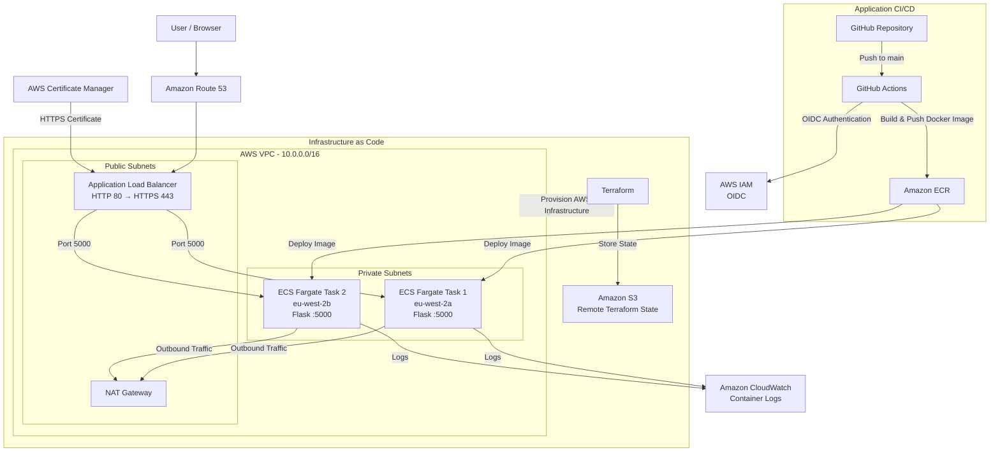

# ECS Cloud Support System Architecture

```mermaid
flowchart TB

    User["User / Browser"]
    Route53["Amazon Route 53"]
    ACM["AWS Certificate Manager"]

    User --> Route53
    Route53 --> ALB
    ACM -->|"HTTPS Certificate"| ALB

    subgraph VPC["AWS VPC - 10.0.0.0/16"]

        subgraph PUBLIC["Public Subnets"]
            ALB["Application Load Balancer<br/>HTTP 80 → HTTPS 443"]
            NAT["NAT Gateway"]
        end

        subgraph PRIVATE["Private Subnets"]
            ECS1["ECS Fargate Task 1<br/>eu-west-2a<br/>Flask :5000"]
            ECS2["ECS Fargate Task 2<br/>eu-west-2b<br/>Flask :5000"]
        end

        ALB -->|"Port 5000"| ECS1
        ALB -->|"Port 5000"| ECS2

        ECS1 -->|"Outbound Traffic"| NAT
        ECS2 -->|"Outbound Traffic"| NAT
    end

    subgraph DEPLOY["Application CI/CD"]

        GitHub["GitHub Repository"]
        Actions["GitHub Actions"]
        ECR["Amazon ECR"]

        GitHub -->|"Push to main"| Actions
        Actions -->|"Build & Push Docker Image"| ECR
        ECR -->|"Deploy Image"| ECS1
        ECR -->|"Deploy Image"| ECS2
    end

    IAM["AWS IAM<br/>OIDC"]
    CloudWatch["Amazon CloudWatch<br/>Container Logs"]

    Actions -->|"OIDC Authentication"| IAM

    ECS1 -->|"Logs"| CloudWatch
    ECS2 -->|"Logs"| CloudWatch

    subgraph INFRA["Infrastructure as Code"]

        Terraform["Terraform"]
        S3["Amazon S3<br/>Remote Terraform State"]

        Terraform -->|"Provision AWS Infrastructure"| VPC
        Terraform -->|"Store State"| S3
    end
```